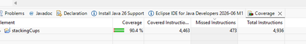
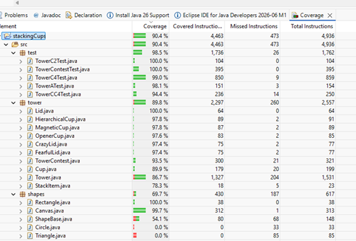
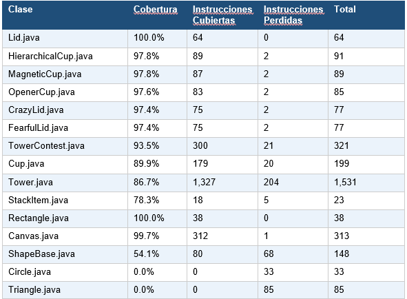
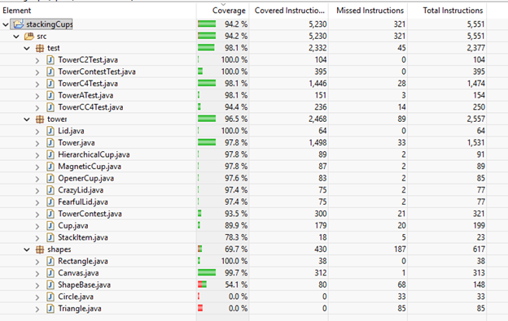
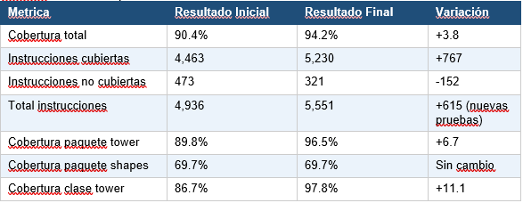

## ESCUELA COLOMBIANA DE INGENIERIA
## DESARROLLO ORIENTADO POR OBJETOS
## PROYECTO INICIAL – CICLO 5
Informe de Analisis Dinamico - Cobertura de Pruebas JUnit
## Autores: Natalia Andrea Rodriguez Torres / Daniel Jose Villamizar Castellanos
Fecha: Abril 2026 | stackingCups

## 1. Introducción
Este informe  documenta  el análisis dinámico aplicado  al  proyecto inicial stackingCups. Dicho
informe consiste  en  medir  la  cobertura  de código alcanzada  por  las  pruebas  unitarias  JUnit
mediante la herramienta IDE eclipse.

El objetivo establecido es superar el 75% de cobertura sobre el código de dominio. Este informe
presenta el resultado inicial obtenido antes de cualquier mejora, el análisis de los resultados, las
decisiones tomadas y el resultado final alcanzado.

## 2. Resultado Inicial
Resultado general:
- Al  ejecutar  todas  las  clases  de  prueba  existentes  (TowerC2Test,  TowerContestTest,
TowerC4Test,  TowerATest,  TowerCC4Test)  sobre  el  proyecto,  se  obtuvo  el  siguiente resultado inicial:

## Análisis:
Total: 90.4%
Instrucciones cubiertas: 4,463 de 4,936
Instrucciones no cubiertas: 473

Este resultado inicial ya supera el 75% requerido. Aun así, analizamos el resultado especifico de
cada clase, y se identificaron faltas de cobertura en algunas partes.

Resultado por clase:

Analisis de resultados:

Las clases con mayor cantidad de instrucciones sin cubrir en el paquete de dominio fueron:

- Tower (86.7%): 204 instrucciones sin cubrir. Siendo la clase principal del proyecto con
1,531  instrucciones totales,  concentraba  el mayor  volumen  de  codigo  no revisado. Las
ramas  no  cubiertas  correspondian  a:  caminos  de  error  en  removeCup/removeLid  con
elementos inexistentes, ramas de popCup y popLid con estructuras vacias, duplicados en
pushCup/pushLid, la logica de makeVisible cuando la torre supera el limite de altura, y el
metodo makeInvisible sin haber inicializado visibilidad.

- StackItem (78.3%): 5  instrucciones  sin  cubrir  de  23.  Al  ser  una  clase  abstracta,  su
cobertura depende de sus subclases concretas.

- Cup (89.9%): 20 instrucciones sin cubrir de 199. Ramas relacionadas con flujos visuales
del canvas no ejecutadas en modo invisible.

El paquete shapes presentó una cobertura del 0% en Circle y Triangle, y una cobertura del 54.1%
en ShapeBase.

Estas clases son componentes de visualizacion cuya unica responsabilidad es dibujarse sobre
el Canvas. Escribir pruebas JUnit para estas clases no sería lo correcto, pues al depender del
Canvas AWT, se sale de la lógica del dominio, lo cual no aporta valor de verificación para el
informe.

## Decisiones:
Se descarto agregar pruebas para el paquete shapes.
Se amplio TowerC4Test.java con pruebas que cubren mejor a Tower, estas fueron las siguientes:
- Ramas de error: removeLid no debería eliminar una tapa que no existe - removeCup no
debería eliminar una taza que no existe.
- Estructuras vacias: popCup no debería funcionar si no hay tazas en la torre; popLid no
debería funcionar si no hay tapas.
- Restriccion de unicidad: pushCup no debería permitir agregar una taza con número ya
existente - pushLid tampoco debería permitir tapas duplicadas.
- Casos  borde: height()  debería  retornar  0  con  una  torre  vacía;  lidedCups()  no  debería
reportar  tazas  tapadas  si  nunca  se  llamó  cover();  stackingItems()  debería  retornar  un
arreglo vacío si la torre no tiene elementos.
- Logica de reorganizacion: orderTower() debería colocar la taza antes que su tapa cuando
tienen  el  mismo  número - reverseTower()  debería  invertir  exactamente  el  orden  de  los
elementos.
- swapToReduce(): debería  sugerir  un  intercambio  que  efectivamente  reduzca  la  altura
cuando  existe  una  mejora  posible;  no  debería  sugerir  ningún  intercambio  si  ninguno
reduce la altura.
- cover(): no  debería  tapar  ninguna  taza  si  no  hay  tapas  en  la  torre;  debería  tapar
exactamente las tazas que tienen su tapa presente cuando hay múltiples.
- makeVisible(): no  debería  hacerse  visible  si  la  altura  de  la  torre  supera  el  límite  de
visualización.

## 3. Resultado Final

Analisis - Tabla comparativa:

El aumento de 3.8% en cobertura total refleja la efectividad de las nuevas pruebas. El aumento
de instrucciones totales (+615) se debe a que las pruebas adicionales ejecutan rutas de código
que antes no eran alcanzadas, mostrando instrucciones que el contador no había registrado.

## 4. Conclusión
El proyecto stackingCups alcanzo una cobertura final del 94.2% sobre el total de instrucciones,
superando el  objetivo  del  75%  establecido.  El  paquete  de  dominio  tower  logro  un  96.5%  de
cobertura,  con la  clase Tower pasando  de  86.7%  a  97.8%  gracias  a  las  pruebas adicionales
agregadas.

La decisión de no cubrir el paquete shapes con pruebas unitarias fue una decisión de análisis,
no una omisión, pues las clases graficas no tienen comportamiento verificable en modo invisible
ni hacen parte del dominio.

Para  finalizar,  la  meta  de más del  75%  de  cobertura  del código de  dominio  fue  alcanzada  y
superada con éxito, cumpliendo el objetivo inicial.
